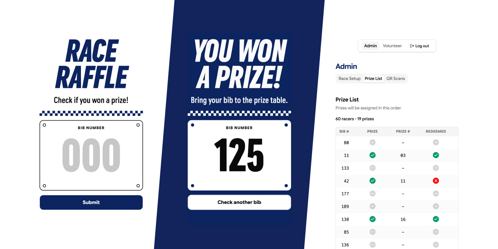

# Race Raffle

Self-serve raffle system for race fundraisers with verified prize pickup.

- Built for and used at the Ability First nonprofit fundraiser race in Provo, Utah
- Racer bib number check with instant win/lose result
- Prizes spread across check-in order so early and late finishers have the same chance
- Prize table lookup for marking prizes as picked up
- Prize list generation based on expected racer and prize counts
- Admin dashboard with prize list status and QR code scan tracking
